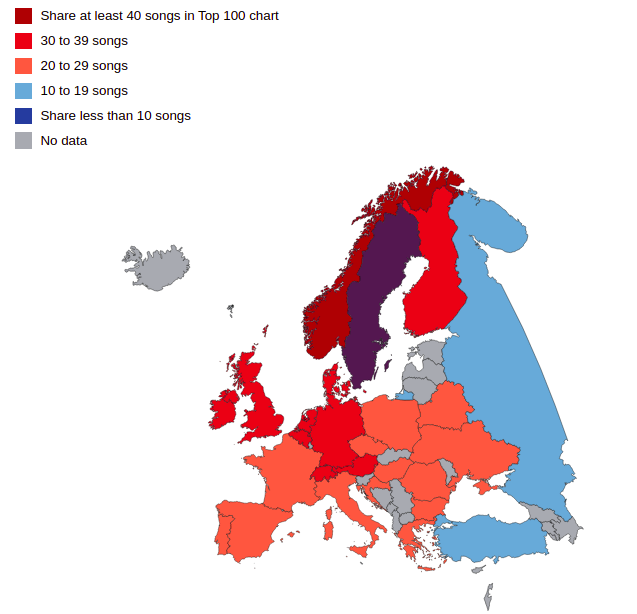

# Music Preference and Clustering in Europe

Europe is home to 50 sovereign nations, 23 official languages and 40 bilateral borders. Cultural theorists would describe the region as a melting pot, much like the United States of America. As cultures and blood have mixed, Europe's music preference has become more and more homogenous. I produce an interactive data visualization which proves this point.

## Methodology

I scraped the T-100 songs chart of each European nation and used a string matching library called [fuzzywuzzy](https://github.com/seatgeek/fuzzywuzzy) to find overlaps between each nation's musical preference. The similarity score is indicated categorically by the hue in the graph. See below:



## Installation

Using npm:

```
npm install
```

Serve locally:

```
npm start
```

## Addendum

I consulted with Billboard data originally but decided to use [Shazam](https://www.shazam.com/charts/) data because they had chart data for almost every country in Europe. I used Selenium, an open source web testing framework to parse the data from the site.